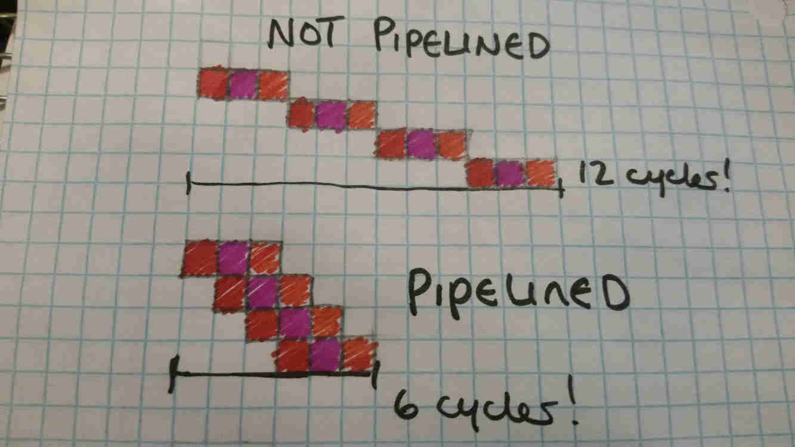
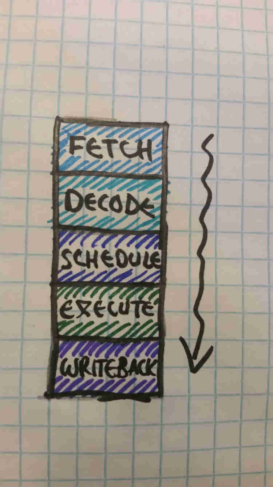

# Pipelines and Execution

---

**Execution and the Clock**

Every clock cycle, the CPU reads in an instruction, decodes it, and then executes it (very simplified!).

However, some instructions are more complicated than others. For example, multiplying two numbers is a lot more work than just adding or subtracting two numbers. Dividing two numbers is a similar amount of work, but with fewer opportunities for parallelism than multiplication, making it very slow. All of these are more complicated than a nop (pronounced no-op) which, as its name may suggest, doesn't do much.

Okay, so some instructions take longer than others to calculate. Some instructions therefore take multiple clock cycles. However, it's also important to note that loading instructions from memory and decoding them also takes time and computing power, oftentimes even more than executing the actual instructions themselves!

The simplest way to do this is to split the CPU into different components that each do a different task, and have some timing-based system (the *Control Unit*) keep track of how to coordinate it. For example, the following is how an addition instruction may be executed:

Cycle 0 : Load an instruction from memory

Cycle 1 : Decode the instruction. The instruction tells us to add registers A and B, and store the result in C.

Cycle 2 : Connect registers A and B to an *Arithmetic Logic Unit (ALU)* and instruct it to add its inputs. It performs the task.

Cycle 3 : Get the results from the *ALU* and store the result in register C. At the same time, increment the *Instruction Pointer* so that the *Control Unit* can fetch the next instruction.

--

Let's compare that to how a multiply might work:

Cycle 0 : Load an instruction from memory

Cycle 1 : Decode the instruction. The instruction tells us to multiply registers A and B, and store the result in C.

Cycle 2 : Connect registers A and B to an *Arithmetic Logic Unit (ALU)* and instruct it to multiply its inputs. It begins to perform the task.

Cycle 3 : The multiplier grinds away at its work.

Cycle 4 : The multiplier grinds away at its work some more.

Cycle 5 : The multiplier grinds away at its work a while longer, and finishes up.

Cycle 6 : Get the results from the *ALU* and store the result in register C. At the same time, increment the *Instruction Pointer* so that the *Control Unit* can fetch the next instruction.

--

As can be noted, the CPU takes a bit longer to multiply than it does to add. However, consider what is going on in the fetch and decode units during the execution stage; nothing. These parts of the CPU are simply idling around, twiddling their thumbs with nothing to do! what if we could keep them occupied and give them useful work to do? This is the basic principle of CPU pipelining.

---

**The Pipeline**

A simple way to think of this is like an assembly line; each instruction can be split into different stages, and different stages of different instructions can be run in parallel, each in their corresponding part of the CPU.

This leads to a tremendous improvement in performance. For example, suppose we had a CPU where all instructions took exactly 5 cycles (for simplicity). Let's also disregard any effects of branches. Being able to execute them in a pipeline provides us with a 5x improvement in throughput! A larger number of pipeline stages gives us even more of an improvement!

In practice, things get a bit more complicated, but in general, we get much more performance, and the average effective latency of each instruction tends toward 1.



CPUs are typically split into several pipeline stages, each with a different name and function. Though this can definitely be quite flexible, and exact stages vary from CPU to CPU, modern CPUs typically have *FETCH*, *DECODE*, *SCHEDULE*, *EXECUTE*, and *WRITEBACK*. This of course varies, as most modern high-end CPUs have 10-20 stages (for more throughput!) and different architectures will emphasize certain functionality more than others. For example, most early [RISC CPUs](riscvcisc.md) used only 5 pipeline stages; *FETCH*, *DECODE*, *EXECUTE*, *MEMORY ACCESS*, and *WRITEBACK*, where *MEMORY ACCESS* is specifically used for interactions with memory.

The *SCHEDULE* stage(s) in modern CPUs is due to the complexity created from Out-of-Order Execution, and the fact that modern CPUs tend to be very superscalar, where they may in fact fetch/decode/execute multiple instructions per cycle, and utilize more than one pipeline running in parallel. The exact details of this are beyond the scope of this specific article however.




---

**Hazards!**

One concern with a pipeline is the presence of *Hazards.* *Hazards* are dependencies between individual instructions in the pipeline that prevent instructions from being issued right away. For example, suppose we have the following set of instructions:

```
a = b + c
f = d * e
g = a + f
```

Cycle 0: Our CPU first isses an instruction to add **b** and **c**, storing the result in **a**. Let's say addition takes 1 cycle.

Cycle 1: The CPU issues an instruction to multiply **d** and **e**, storing the result in **f**. Let's say multiplication has 3 execution cycles. In this cycle, the CPU also finishes executing the previous instruction (as it only took 1 cycle).

Cycle 2: The CPU attempts to issue an instruction to add **a** and **f**. However, while **a** has been evaluted, **f** has not, as the multiplication will take another two cycles. As a result, the CPU cannot continue until the multiply has completed. Nothing is put into the pipeline (unless the CPU can find other work to do in the meantime). The empty space in the pipeline is often referred to as a *Bubble*.

Cycle 3: The CPU continues to wait, as the multiply instruction finishes up.

Cycle 4: Now that both previous dependencies have been completed, the third instruction (**g** = **a** + **f**) can finally be issued.

Cycle 5: The value of **g** is now available.

--

Hazards can slow down execution if the CPU is unable to find other work to do in the meantime. A lot of work on modern CPUs comes down to maximizing [IPC](ipcandilp.md) by finding other work for the CPU to do in the meantime. Modern CPUs also often feature multiple parallel pipelines, making the problem more complicated.

One simple solution to this can actually be done by the compiler, which is *Instruction Scheduling*. Simply put, most code has some extent to which instructions can be rearranged without changing the outcome of the code. In the above example, the first and second instructions can actually be swapped, as there are no dependencies between the two. In fact, swapping them would even reduce the number of cycles that the CPU would take to run the above code. I'll leave the explanation up to the reader to figure out. By cleverly arranging instructions such that the instructions with high latency (like multiply) are not immediately followed by instructions dependent on them, *Instruction Scheduling* makes sure that most of the time, the CPU does not need to look hard for other work to do while waiting on slower instructions.

---

**Bypasses and Stalls**

Suppose we have a CPU with the following instruction set and latencies:

Instruction | Number of Execution cycles
------------|---------------------------
Add         | 1
Subtract    | 1
Multiply    | 3
Divide      | 10
Compare     | 1
Branch      | 2
Jump        | 2
Load        | 3+
Store       | 1

(For those unaware, *compare*, *branch* and *jump* would be for control flow, and *load* and *store* would be for memory operations. Loads will take a different amount of time depending on where the data being loaded is in the [memory hierarchy](../Memory/caches.md).)

However, if the *WRITEBACK* stage of the pipeline is all the way at the end, and if all of these instructions go through the same pipeline, there seems to be a bit of a problem. The *divide* instruction seems to require that the pipeline contain at least 10 execution stages. Assuming we also have *FETCH*, *DECODE*, *SCHEDULE* and *WRITEBACK* stages, that makes our CPU pipeline *14 stages long!* And, since *WRITEBACK* is at the end of that, that makes all of these instructions, including fast ones like *add* also 14 stages long. That makes *hazards* much harder to deal with.

The most commonly used solution to this problem is to use *Bypasses*. Simply put, if the CPU detects that the instruction it wants to issue depends on an instruction that, while still in the pipeline, finishes early (like *add*), it can tell the instruction to read the result *directly from the pipeline*, rather than having it wait until the result is written to a register. Each pipeline stage may simply cache its previous result in order to make it available to the following instruction. Utilizing this of course either requires a smarter CPU or an instruction set with support for this, and backwards compatibility strongly encourages the first.

--

Memory creates another problem, as the exact amount of time to load memory can vary significantly. In the case of memory loads, the CPU will typically stop reading instructions in and wait until the data it needs becomes available. This is called a stall. If the CPU can find other work to do in the meantime, it may do that work while it waits, but otherwise the CPU will be forced to stall.

---

**Branches**
