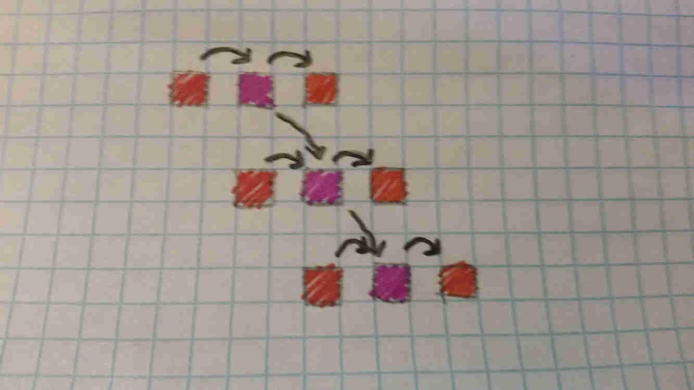

# Pipelines and Execution

---

**Execution and the Clock**

Every clock cycle, the CPU reads in an instruction, decodes it, and then executes it (very simplified!).

However, some instructions are more complicated than others. For example, multiplying two numbers is a lot more work than just adding or subtracting two numbers. Dividing two numbers is a similar amount of work, but with fewer opportunities for parallelism than multiplication, making it very slow. All of these are more complicated than a nop (pronounced no-op) which, as its name may suggest, doesn't do much.

Okay, so some instructions take longer than others to calculate. Some instructions therefore take multiple clock cycles. However, it's also important to note that loading instructions from memory and decoding them also takes time and computing power, oftentimes even more than executing the actual instructions themselves!

The simplest way to do this is to split the CPU into different components that each do a different task, and have some timing-based system (the *Control Unit*) keep track of how to coordinate it. For example, the following is how an addition instruction may be executed:

Cycle 0 : Load an instruction from memory

Cycle 1 : Decode the instruction. The instruction tells us to add registers A and B, and store the result in C.

Cycle 2 : Connect registers A and B to an *Arithmetic Logic Unit (ALU)* and instruct it to add its inputs. It performs the task.

Cycle 3 : Get the results from the *ALU* and store the result in register C. At the same time, increment the *Instruction Pointer* so that the *Control Unit* can fetch the next instruction.

--

Let's compare that to how a multiply might work:

Cycle 0 : Load an instruction from memory

Cycle 1 : Decode the instruction. The instruction tells us to multiply registers A and B, and store the result in C.

Cycle 2 : Connect registers A and B to an *Arithmetic Logic Unit (ALU)* and instruct it to multiply its inputs. It begins to perform the task.

Cycle 3 : The multiplier grinds away at its work.

Cycle 4 : The multiplier grinds away at its work some more.

Cycle 5 : The multiplier grinds away at its work a while longer, and finishes up.

Cycle 6 : Get the results from the *ALU* and store the result in register C. At the same time, increment the *Instruction Pointer* so that the *Control Unit* can fetch the next instruction.

--

As can be noted, the CPU takes a bit longer to multiply than it does to add. However, consider what is going on in the fetch and decode units during the execution stage; nothing. These parts of the CPU are simply idling around, twiddling their thumbs with nothing to do! what if we could keep them occupied and give them useful work to do? This is the basic principle of CPU pipelining.

---

**The Pipeline**

A simple way to think of this is like an assembly line; each instruction can be split into different stages, and different stages of different instructions can be run in parallel, each in their corresponding part of the CPU.

This leads to a tremendous improvement in performance. For example, suppose we had a CPU where all instructions took exactly 5 cycles (for simplicity). Let's also disregard any effects of branches. Being able to execute them in a pipeline provides us with a 5x improvement in throughput! A larger number of pipeline stages gives us even more of an improvement!

In practice, things get a bit more complicated, but in general, we get much more performance, and the average effective latency of each instruction tends toward 1.

CPUs are typically split into several pipeline stages, each with a different name and function. Though this can definitely be quite flexible, and exact stages vary from CPU to CPU, modern CPUs typically have *FETCH*, *DECODE*, *SCHEDULE*, *EXECUTE*, and *WRITEBACK*. This of course varies, as most modern high-end CPUs have 10-20 stages (for more throughput!) and different architectures will emphasize certain functionality more than others. For example, most early [RISC CPUs](riscvcisc.md) used only 5 pipeline stages; *FETCH*, *DECODE*, *EXECUTE*, *MEMORY ACCESS*, and *WRITEBACK*, where *MEMORY ACCESS* is specifically used for interactions with memory.

The *SCHEDULE* stage(s) in modern CPUs is due to the complexity created from Out-of-Order Execution, and the fact that modern CPUs tend to be very superscalar, where they may in fact fetch/decode/execute multiple instructions per cycle, and utilize more than one pipeline running in parallel. The exact details of this are beyond the scope of this specific article however.

---

**Hazards!**

In the above diagram, colored squares represent stages of executing an instruction and arrows represent dependencies.

---

**Branches**
