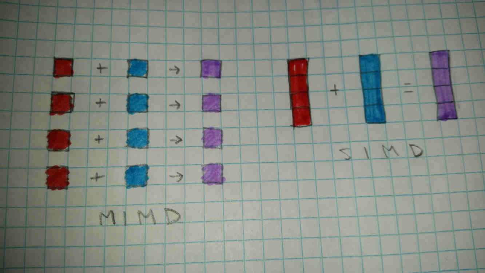
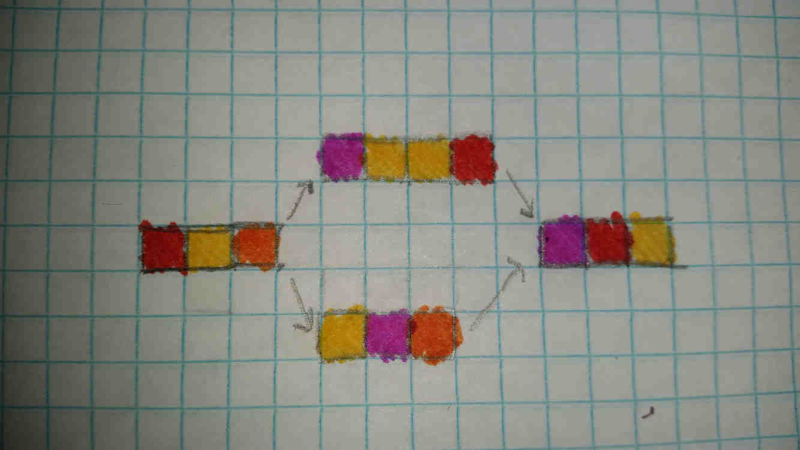
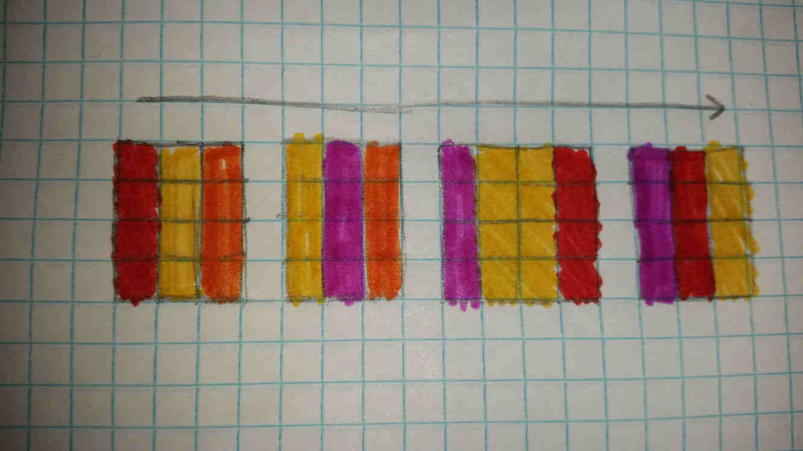

# SIMD v. MIMD

---

**What Do These Mean?**

SIMD and MIMD are types of parallelism. There are many ways to classify parallelism, and SIMD and MIMD are only part of the picture, but they're a very useful way to look at many types of cases.

*MIMD means Multiple Instruction, Multiple Data.* It refers to the standard type of parallelism where multiple execution units (CPUs) read multiple instruction streams in parallel, and apply those instructions to different data. This is arguably the most flexible type of parallelism.

*SIMD means Single Instruction, Multiple Data.* It refers to a type of parallelism where multiple execution units are being fed the same instruction stream, but working on different data. This can be conceptualized as similar to a map operation; a single function applied to a collection of items to create a new collection. *SIMD* and *Vector* are terms often used interchangeably.

---

**Basics Uses of SIMD**

In the above image, we are trying to add four objects (red) to another four objects (blue) pairwise, to create a set of four resulting objects (violet). In the MIMD case, this takes four instructions; one for each addition that needs to take place. In the SIMD case, it takes one instruction. Most modern CPUs support between 4 and 16 -way SIMD.

In the case of 16-way SIMD, that's a 16x theoretical improvement in performance. This may sound incredible, however not all operations can be accelerated with SIMD. If any one of the above operations were different from the others, or if they had to be performed sequentially, then the parallelism available to us is restricted. It is also important to note that the data must be arranged properly in the CPU registers for this to work. Arranging this data properly has associated overhead, which further limits the number of cases where SIMD can be used.

---

**Branching in SIMD**

Suppose we have a task like the one above. Each chunk of colored blocks represents a set of instructions. The two parallel to each other are different routes through a branch; essentially an if-else statement. Suppose we have to apply a similar kind of function to each element of an array. Can we do this with SIMD? If so, is it practical?

If each colored block above takes a single cycle to execute (assuming no pipeline-related latency), the above task should take a maximum of 10 cycles, a minimum of 9, and an average of 9.5. If we want to run this 4 times, this is 36-40 cycles, with an average of 38.

Unfortunately, the branch creates a slight complication here. SIMD requires only a *Single Instruction* to be executed at a time. Here, depending on the path that each parallel thread takes, the chances are slim that this will actually happen. With only 4 threads and a 50% chance for each direction in the branch, there is a 1/8 chance that they will all take the same path. This gets exponentially worse with the number of threads.

We can work around such limitations, but it will cost us some performance. Like in the above image, we can simply run each branch sequentially. Most processors with SIMD support allow individual execution units to be enabled/disabled independently, like in the image below. This may involve a few extra instructions though.

In the above image, the following happens:
* The code before the branch is executed.
* The branch is encountered! Here, threads that go one way (if) stay enabled, while the threads going the other way (else) are disabled.
* The code for the first branch (if) is executed.
* The execution mask is inverted. This means that currently enabled threads (if) are disabled, and currently disabled (else) are reenabled.
* The code for the second branch (else) is executed.
* The execution mask is cleared. All threads are enabled.
* The code after the branch is executed.

Assuming that the mask manipulation takes extra instructions (represented by the green/white blocks), the above task now takes 16 cycles. If the CPU has some way to skip branches with no enabled threads (unlikely as far as I'm aware), this could take only 12 cycles on rare occasions.

16 cycles is more than a 9.5 average, but this it is much better than 36-40 cycles. It's not 4x better, and wouldn't be even without those extra mask manipulation instructions, but it's better than running them sequentially.

We *could* still run them in MIMD across multiple cores, but there's quite a bit of overhead to that, so it won't be practical for most cases. It also wouldn't be practical on very small scales eitehr, due to the aforementioned overhead for arranging data in registers properly.

---

**When is SIMD Really Useful?**

SIMD is good for:
* Math-heavy code. Especially linear algebra
* Code with a lot of obvious, simple parallelism (like mapping a simple function to an array)

SIMD is bad for:
* Code heavy in branching. Especially nested branching
* Code that has parallelism, but with different functions in parallel
* Code that has instruction-level parallelism, but too complex and varied for simple arrangements in registers
* Code with high-level parallelism

---

**How Do I Take Advantage of SIMD?**

* Most languages with dedicated array processing libraries are optimized for SIMD.
* Use a compiled language with a good compiler (C/C++, Rust, etc.), or a JIT language with vectorization support (Java?, C#?).
* Run code on the GPU when practical. GPUs are just massive SIMD engines, often with 32-64 -way SIMD.
* If your language supports vectorization optimizations, array operations will often be optimized.
* Arranging memory into Structs-of-Arrays instead of Arrays-of-Structs can lower overhead to SIMD optimizations by simplifying the process of arranging memory in registers.
* Use any vector extensions to your language. Most major languages (even web languages like Javascript and Web Assembly) support them, or are at least planned to support them soon.
