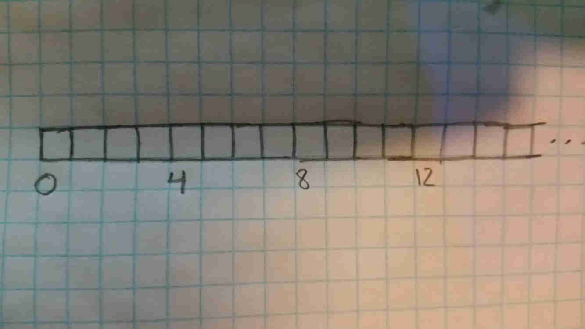
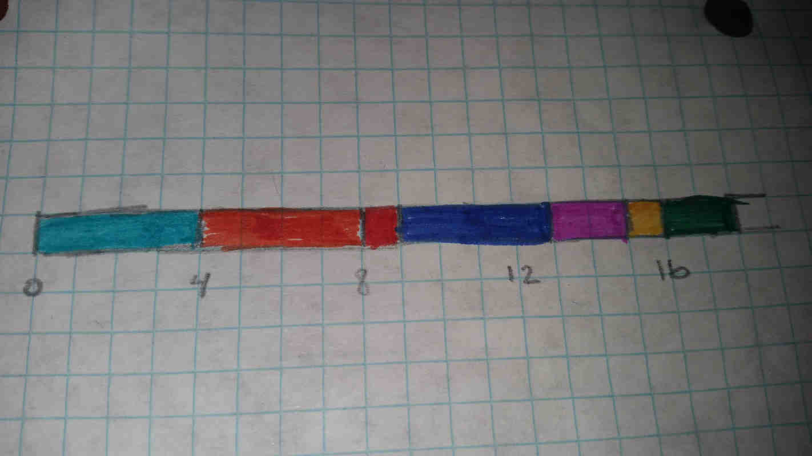
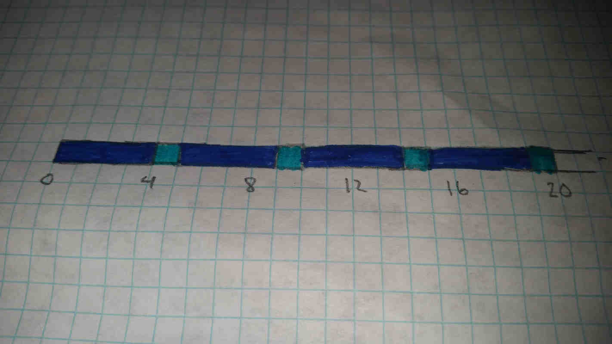
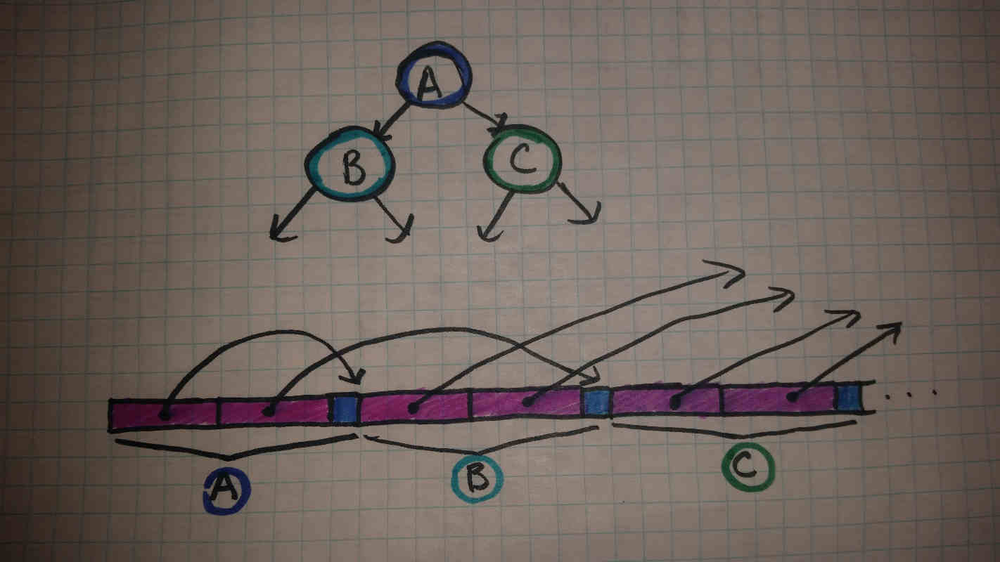

# Bunches of Bytes

---

Ultimately, RAM is just one big array of bytes. So how does the computer keep track of everything? How can you have programs as complex as GCC, Google Chrome, or Dwarf Fortress full of complex data structures if all you have is a big array of bytes?

---



Here's a basic diagram. Each box in the array is a byte. As with any array, each element has a unique index that can be used to locate it. These indices are integers, and are commonly called pointers in lower-level languages that utilize them. Undestanding how to properly utilize pointers is incredibly powerful, but beyond the scope of this article.

Here are some common terms you may hear surrounding low-level memory details:

**Bit**: The word "bit" comes from Information Theory, and means "binary digit", though there is sometimes a distinction drawn between "bits" and "binary digits" in the field. An in-depth exmplanation of binary is beyond the scope of this article, but to summarize and oversimplify, bits are the "ones and zeros" of computing and they work a lot like digits in numbers.

**Byte**: A Byte is a group of 8 bits. It has 2^8, or 256 possible states. This is the smallest individually addressable unit of RAM, though individual bits can be accessed via bit twiddling.

**Word**: This used to mean the primary size of memory that the processor works with, and still kind of does. However, due to 32 bit computers lasting so long, "Word" still normally just refers to a contiguous group of 32 bits, of 4 bytes, normally with 4-byte alignment.

**Half-Word**: 2 bytes / 16 bits, normally 2-byte aligned.

**Double-Word**: 8 bytes / 64 bits, normally 8-byte aligned.

**N-bit Computer**: N refers to the largest possible number that a computer can work with in a single instruction. For example, 32-bit computers can work with at the most 32-bit numbers, or numbers that take up 4 bytes of RAM. 32-bit is currently obsolete, as a 32-bit number has only 2^32 possible states, and thus can only represent numbers up to 4,294,967,295. This limits the ammount of RAM in such systems to only 4 GB. Most current systems are 64-bit, allowing a theoretical maximum of 16 exabytes (16 billion gigabytes, or about 1 internet, give or take), though address buses typically put the actual limit a bit lower.

**Pointer/Reference**: A form of integer type used in many lower-level and imperative languages, used to store the index of a particular piece of data in memory. Its size is normally equal to, or slightly bigger than the size of the memory bus. For example, a 32-bit computer uses 4-byte pointers, and a 64-bit computer uses 8-byte pointers. In very low-level languages that allow pointer arithmetic (such as C/C++), pointers can be treated as integers, though this is a double-edged-sword, allowing both incredible optimizations and incredible headaches from all the horrifying bugs they can cause. Many languages also feature more restricted forms of pointers, often called References, though the exact functionality and naming varies across languages.

**Alignment**: This refers to how a piece of data is stored in memory, specifically some numerical details about its index/pointer. CPUs often put restrictions on alignment for efficiency/performance reasons, but that can have significant impacts on memory consumption if ignored. This is beyond the scope of this article however.

**Virtual Memory**: Every program has its RAM start at address 0, as this simplifies programming. However, how does this work with multiple programs? Computers solve this problem by translating between physical memory (the organization of data in RAM) and *Virtual Memory*, or the organization of memory as seen by each program. This is also the main method by which programs are kept from interfering with one another. How exactly this works is beyond the scope of this article.

---

**So How are Items Organized in RAM?**

It's clear that if we stored a pointer for every individual byte of every item in memory, we would quickly run out of memory, especially as pointers take up memory too, as many as 8 bytes. The obvious answer to this is that we only need to store one pointer for objects that consist of more than one byte. If we know how many bytes the object takes up, and we know its pointer, we know the entire area of RAM it exists within; essentially, just a small slice of an array.

In the case of complex objects and types, we can see groups of many smaller objects as a group of bytes. So long as each object of a given type is always organized in the same way, we don't need to store pointers for each of the member variables. Instead, pointers to member variables can be calculated at runtime, as needed.

---

```Go
  type ExampleType struct {
    a int32
    b int8
  }
```

In this code example (written in Golang), the above type (ExampleType) consists of a 4 byte value (a) and a 1-byte value (b). If b is stored immediately after a in RAM, and a is stored at the object's location, then provided a pointer to an object of type ExampleType, we can calculate the location of a by adding its offset to the pointer (0 in this case), and b by adding its offset to the pointer (4 in this case, as it directly follows a). This is almost always something that the compiler implements for you.

This is also an advantage that statically typed languages have over dynamically typed languages; in dynamic languages, the exact layout of memory is almost never predictable outside of very simple cases. This results in tons of metadata and additional pointers, filling up memory with extra data. It also results in much more complicated and expensive calculations in order to locate necessary data.



Theoretically, items in RAM can be laid out like the above diagram (where different colors represent different items). Due to memory alignment and memory management, it's often important to keep it more organized and more complicated than this.

The pointer to each item is the index of the first byte it contains in memory. For example, the leftmost item in the diagram above has a pointer of 0, the item to the right of it has an pointer of 4, and so on.

---



The above diagram shows what an array of the aforementioned ExampleType might look like. Arrays are a simple way of organizing memory easily; if we have an array of type T and containing N items, we know that the array would take up N * K bytes, where K is the number of bytes that T takes up. In the above array, we have an array of 4 ExampleType values. ExampleType takes up 4 + 1, or 5 bytes. 4 elements of the array * 5 bytes per element means the array fills 20 bytes of memory.

In addition, if we want the pointer to any particular element of the array, we can do so very efficiently. Let's say we want element 3. We take our array index (3) and multiply it by the size of ExampleType (5). We then add the result to the pointer to the beginning of the array (0 in this case). This means that element 3 (the fourth element in the array) starts at address 15 in RAM.

As each memory access can easily cost [hundreds of clock cycles](caches.md) in the worst case, such a simple calculation is far faster than jumping from node to node in a tree. Even an expensive hash function is often faster than a tree; this is why hash tables are so fast.

---

What about more complex data strutures? The below diagram shows 3 nodes of a tree. Each node of the tree has the following definition:

```Go
  type ExampleNode struct {
    leftchild  *ExampleNode
    rightchild *ExampleNode
    value int8
  }
```

For those unfamiliar with Go syntax (or the syntax of many other lower-level languages for that matter), a value of type T is just the set of bytes for T, while a value of type * T is a pointer to said data. The pointer may store an index for a value of that type, or alternatively store a null value (zero) to indicate that it points nowhere. The above type is a common way to define a node for a tree in these kinds of languages, with each pointer providing the location of a child node.


