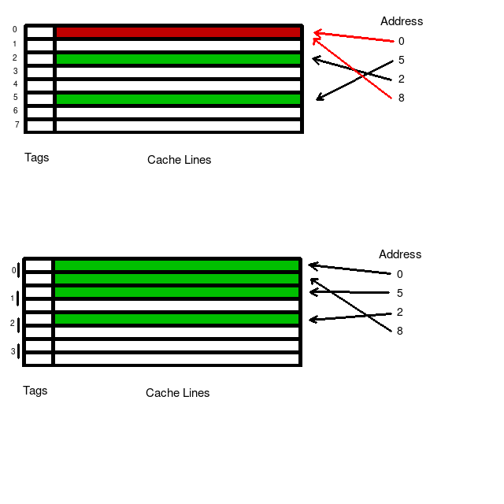

# Caches

---

**So How Do Caches Work?**

Overall, a cache works a little like a hash table; it takes a key (a range of memory addresses) and some data (more specifically, the data between those addresses). However unlike a hash table, a cache will automatically throw out data that hasn't been used lately.

If the data that you're looking for isn't in the cache, then the CPU will check somewhere else for the data; either in a different cache, out in RAM, or possibly out on the disk if your OS uses swap memory and you're low on RAM. This is called a cache miss.

Functioning like a hash table also means that a piece of data can only be located in a single location in the cache, which minimizes the amount of time and power needed to locate some data. Cache Associativity makes this a little more complicated though, as discussed below.

The hashing algorithm used doesn't need to very complex either. Usually it just takes the form of taking a select group of bits from the memory address. Due to cache lines and memory alignment, the lowest 6 bits or so can normally be discarded, but the next few significant bits will tend to be used for the hash.

When talking about memory, a fundamental tradeoff exists between capacity and speed. To take advantage of this, caches tend to be structured in a hierarchy; smaller, faster caches are kept close to a CPU core, and larger, slower caches are kept further away.

Caches are based on the idea of locality. More specifically, *Temporal Locality* and *Spatial Locality*.

*Temporal Locality* is the idea that after a CPU uses some data, it will likely need that same data again soon. If you have a function that is working with a particular object, it's probably not going to request one value from that object and then start jumping randomly around memory and never come back to it. Instead, it will probably request a lot of data from that object before the program moves onto working with other data.

*Spatial Locality* is the idea that after a CPU uses some data, it's likely to need nearby data soon. If you have an object in your program, all the data required for that object is likely stored in a C-style struct (or something similar). As a result, all of the data is nearby in memory. If you use one variable stored there, chances are you'll use another one soon, thus making a request for nearby memory.

Okay, so how does the cache achieve these? Well, the hash-table-like functionality clearly provides temporal locality; something loaded into the cache will stick there until booted out. If it's been used lately, it's probably in the cache and will be much faster to access than going out to RAM.

Let's start with cache lines.

---
**Cache Lines**

Cache Lines are used for two reasons: *spatial locality* and *minimizing overhead*.

Storing the range of addresses for some data takes a bit of memory. If we have 48 bit addresses, the address for a single byte takes up a minimum of 6x more memory than the actual byte does. This is a *lot* of overhead, and gives us no temporal locality above the bit level. So instead of one byte, caches typically use groups of 64 bytes. So that they don't have to store two numbers for the range, they only store one address and assume the end of the cache line is 64 bytes later in memory. A 64B cache line will also use a 64 byte alignment to knock off an extra 6 bits from that address and simplify some of the logistics.

Due to the relatively small size of cache lines, it's not uncommon for caches to contain hundreds to thousands of them.

---

**Cache Associativity**

Okay, but what about conflicts? What about when I have multiple cache lines that end up with the same hash? What if I need both?

Cache Associativity means that each entry in the hash table has multiple cache lines associated with it. This is slower, more complex, and more power-hungry, but it tends to be worth it so long as you don't go completely overboard with it. The sweet spot tends to be around 4-way associativity (4 cache lines per table entry), but it's common for larger, less frequently used caches (L3 for example) to be more associative. This reduces conflicts as seen in the diagram above.

The top example shows how multiple addresses may map in a nonassociative cache. The cache has multiple values (0 and 8) that map to the same cache line, creating a conflict. Only one of these values can be stored.

The bottom example shows how 2-way associativity resolves this conflict. With the same set of addresses we wind up with no conflicts. If we loaded more memory later and created a conflict, the cache will normally resolve this by removing the oldest cache line.

---

**Reads and Writes in the Cache**

Reading from and writing to the cache is pretty straightforward.

In the case of a read, the CPU sends an address to the cache. The cache hashes it and checks if it's there. If so, that's a cache hit; the value is copied from the cache line and sent back to the CPU. If not, that's a cache miss. If there's another level of the cache hierarchy, then the address is sent there and the process repeats. If not, the CPU just goes out to RAM.

In the case of a write, the CPU sends an address and a few bytes to the cache. A similar process occurs to when the CPU reads from the cache. The difference is that when a cache hit occurs, the value is written to the cache line and no value is sent back. If no appropriate cache line exists, then the address and data are sent out to RAM.

[Writes to the cache when multiple cores are present is *much* more complicated.](cachecoherency.md)

Another case to consider is when a cache line is removed due to a conflict. Cache lines typically contain a "dirty bit". This functions as a simple boolean value. It is false by default, but is set to true whenever the cache line is changed. If the dirty bit is false, then the rejected cache line is discarded. If the dirty bit is true, then that means it that RAM needs to be updated, and so the changes are sent out to RAM. This costs nothing in terms of latency as far as the CPU is concerned, but it does use some memory bandwidth. Some caches are "write-back", meaning that they will update RAM whenever any change is made. This makes a dirty bit mostly unnecessary, but has a large cost in terms of memory bandwidth (and consequentially power consumption).

---

**Cache Performance**

What can I typically expect out of my caches?

Cache Level | Latency | Associativity | Size | Quantity
------------|---------|---------------|------|---------
L1 | ~1 cycle | 1-4 | 32-128kB | 2 per core (1 data, 1 instruction)
L2 | ~12 cycles | 2-8 | 256-1024kB | 1 per core
L3 | ~40 cycles | 4-16 | 1-16MB | Very few per CPU die
RAM | ~200-300 cycles | N/A | A few Gigs | A few DDR3/4 sticks

This gets more complicated with NUMA architectures though, especially L3 and RAM speeds. This also only applies to CPUs; GPUs are a little different. These numbers are what is common for most x86 CPUs these days and will be different on other architectures like ARM. Don't rely on the associativity or size numbers either; they're more or less just what things tend to be as of writing this. They will depend a lot on the particular CPU architecture you're working with.

In addition, [cache prefetching](prefetch.md) can have a big impact on your performance if you access memory nicely.

---

**Review: How Do I Use Caches Effectively?**

* Reuse as much data as possible in the cache
* Try to maintain temporal and spatial locality when possible; work with the cache, not against it
* Understand how [cache prefetching](prefetch.md) works, and use prefetch-friendly memory access and data structures
* Avoid excessive memory jumps; hash tables are much faster than trees because there are fewer jumps through the data structured (1 v. log(N))
* Keep related memory close together if possible
* Use cache-oblivious algorithms; the more cores, the more important this is!

---

[Okay, but why do we need them anyway?](whycaches.md)
