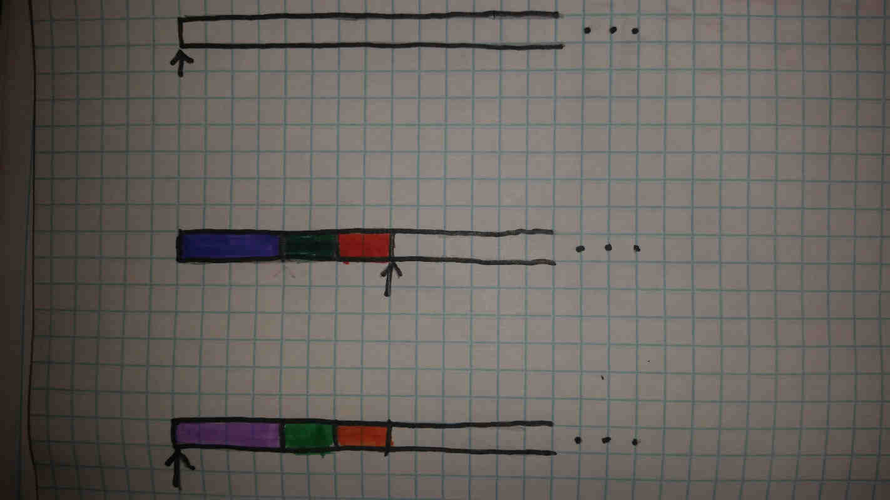

# Stacks and Heaps : Program-wide Memory Layout

---

**Notes:**
* For any mention of pointers, bytes, etc., the [Bunches of Bytes](bunchesofbytes.md) article covers this.

---

**Call Stacks**

Most modern software is based around the idea of a call stack. This is a stack (LIFO) used to quickly allocate data that will be used only for the duration of the current function scope, and is normally a couple megabytes in size. Every time a function is called, the *stack frame* for that function is pushed onto the top of the stack. When that function returns, the *stack frame* is popped off. For this reason, multithreaded programs will utilize multiple stacks, one for each thread. Some parallelism-focused languages even avoid using a call stack and choose to use a heap-allocated graph instead, as stacks don't really support a parallel form of stack frame.

As the stack is of fixed size, it is capable of running out of memory. This most commonly happens from having too deeply nested functions (i.e, from non-tail-optimized recursion) or allocating too much onto the stack. When the stack runs out of space, the program normally crashes due to a *Stack Overflow Error.*

The *stack frame* is the collection of all the data in a function that:
  * Cannot fit inside registers
  * Is both created and destroyed during the duration of the function's evaluation
  * Is necessary to return the function to its state before the function call
  * Is not better allocated on the heap

The last point might be a bit ambiguous. Most languages will avoid doing any kind of *dynamic allocation* to the stack, as in, allocations where the exact size of the data cannot be easily determined at compile time. Common examples include trees and strings. Many languages will also often prevent stack allocation of arrays, as large ones can easily exceed the size of the stack.

---

**How the Stack Works**

Normally, the kind of stack that a programmer might be used to using can be implemented as an array or linked list. The problem with this however is that *stack frames* come in many different sizes, depending on the requirements of the specific function, making standard arrays difficult to use. Untyped lists could solve that problem, but introduce significant overhead and require some kind of additional memory management.

So call stacks are implemented as just a big block of bytes and a pointer.

The *stack pointer* (often abbreviated SP) is normally stored in a dedicated CPU register and stores a pointer to the top of the stack (represented by the arrow in the diagram). When a *stack frame* needs to be added, the number of bytes in the stack frame is added to *SP* (or subtracted to be more accurate, though that will be covered later), thus creating a new stack pointer. The current *stack frame* is placed in the space between the new and old *stack pointers*. Included in the *stack frame* is the old value of *SP* and the old *instruction pointer* (IP), which will both be reset when the function returns.

The top example in the diagram shows an empty portion of the stack.

The middle shows the stack after a new stack frame has been allocated.

The last example is important; it shows the stack after the frame has been popped off. This is done by resetting *SP* to its value prior to allocating the frame. Regardless of how big the frame is, all of it can be cleaned simply by changing *SP*, making it the fastest form of garbage collection aside from unplugging your computer.
