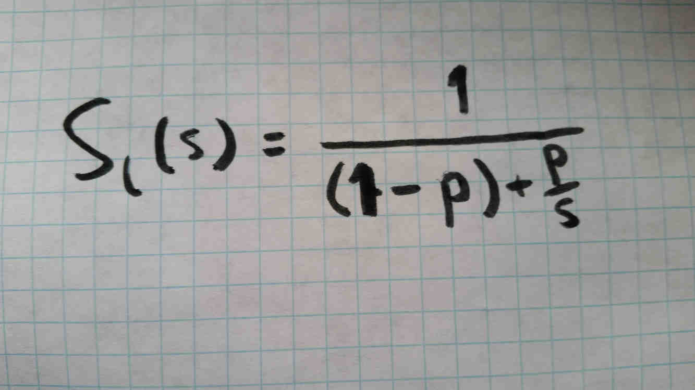

# Amdahl's Law
---

Amdahl's Law is a simple principle for understanding the benefits of optimizations.

In the above diagram, each bar represents a task, divided into color-coded partitions, each representing a different part of that task. Let's say each bar is a function and each partition represents a function that it calls. The size of each partition represents how long that function takes to execute, and the color represents what function is being called. Each function (orange, green, and blue) is called multiple times.

The top bar is the default. 50% of it is orange, 25% blue, and 25% green.

The middle bar is what it looks like if we double the performance of the orange task.

The bottom bar is what it looks like if we double the performance of the blue task.

Clearly, optimizing the orange function is better; it takes up 50% of execution time, and so doubling its performance provides a larger improvement (25%) than doubling the performance of the blue function (12.5%).

Variable | Meaning
-|-
Sl | Theoretical Overall Speedup
S  | Speedup of accelerated code
P  | Proportion of code accelerated

This is Amdahl's Law. Any particular optimization will only acclerate some of your code, and the above formula describes the overall improvement you can expect. If we use the above examples:

Middle bar :
  * P = 50% of code (orange) is accelerated
  * S = 2x improvement
  * Sl = 1 / ((1 - 0.5) + (0.5 / 2)) = 33% improvement

Bottom bar :
  * P = 25% of code (orange) is accelerated
  * S = 2x improvement
  * Sl = 1 / ((1 - 0.25) + (0.25 / 2)) = 14% improvement
