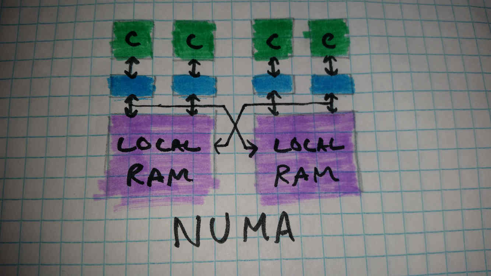

# SMP and NUMA

---

**What are SMP and NUMA?**

*SMP is Symmetric Multiprocessing.* This is a form of parallel architecture where all cores have equal access to system memory. Individual cores may have local caches, but there is no other form of *local memory.* A good example of this is a normal consumer CPU; there are multiple cores, and one global memory space which all cores go through the same couple memory controllers to access.

*NUMA is Non-Uniform Memory Access.* This is a form of parallel architecture where there exists multiple, separate partitions of memory, and different cores have inequal access to memory. A common example of this is a data center; the data center consists of many different computers in a room. Each computer has its own *local memory* which it can access very quickly. Each computer may also be able to access the memory of other computers in the data center, though this is much slower. The exact access latency will vary depending on distance. Other examples are multi-CPU systems, some multi-die CPUs (AMD Epyc), and tiled architectures.

---

**Advantages and Disadvantages of SMP**

Advantages

* There is little need to consider *where* in RAM to store data for optimal performance.

* Increasing Parallelism by using more cores has no disadvantages, provided that such cores.

Disadvantages

* Cache coherency gets very difficult to maintain with large numbers of cores.

* Because cores take up space, it is very difficult to guarantee that all cores will be able to access RAM with the same latency, as different cores will be different distances from RAM and memory controllers.

* Often times, all cores share the same memory bus and memory controllers. If one core using a lot of memory bandwidth, this restricts the bandwidth available to other cores.

* SMP is completely impractical on large scales.

---

**Advantages and Disadvantages of NUMA**

Advantages

* There is no need for the hardware to guarantee equal latency between all cores and all memory, simplifying hardware and improving overall performance.

* NUMA is theoretically infinitely scalable, so long as the software can deal with large memory latencies.

Disadvantages

* Optimization can be much more complicated, as *which core* is used and *where data is in memory* can have large impacts on performance.

* There are cases where adding more cores may not improve parallel performance, as the combined time (and power) to send data to distant cores and have them execute code may be greater than simply executing code sequentially and locally.

* Software has to be able to tolerate the differences in latencies. Extreme optimization may make software difficult to port.

* Large NUMA systems are almost always distributed systems, which has its own consequences.

* The disadvantages of NUMA become much greater on larger scales.

---

**The Present**

Currently there are little to no examples of comsumer NUMA CPUs. It appears as though this is beginning to change however; recent professional and server -grade AMD CPUs (AMD Threadripper and Epyc) utilize NUMA architectures, and almost all major CPU and GPU vendors are planning multi-die processors for the majority of future products to improve yields and scalability. Multi-processor systems have existed for a very long time, but rarely outside of professional use.

Systems with dedicated GPUs can be seen as using a form of NUMA (as the GPU has its own RAM separate from main system RAM).
Multi-GPU systems add even more complexity to this, though are uncommon.

To some extent, any cache-coherent processor without a single, shared cache can be thought of as NUMA to some extent, as cache latency depends on which cache the data is located in, often depending on which cores have been using it recently. This does not affect data not stored in the cache however, and so this may not be considered a NUMA system by some. Examples of this are AMD Ryzen, Threadripper, and Epyc CPUs, as well as Intel Xeon and Xeon Phi CPUs.

The majority of NUMA systems are distributed systems, such as data centers, supercomputers, and some forms of IoT systems.

---

**The Future**

As multi-die processors become more common (which will likely eventually lead to 2.5D and 3D processors), it will become much more difficult to guarantee equal latencies between all cores and memory; even in a system with only one processor and one RAM partition, there likely will be some cores that can access that RAM faster than others. The differences may only be a couple to a couple dozen clock cycles however.

Tiled architectures will probably become more common, as they can be much simpler than non-tiled architectures. It could be argued that many Intel Xeon and Xeon Phi processors are already a form of tiled architecture, due to their memory bus ring. These naturally result in some cores having lower latency RAM access.

Distributed systems will likely become more common as devices become more connected. Aside from that however, most consumer devices will be NUMA, but likely not to a considerable degree. For example, a tiled CPU may exist where cores closer to the memory controllers may be able to access RAM in fewer clock cycles than cores further away, but outside of performance-critical applications, this likely won't be a huge concern.

Cache and memory management may become more explicit at some point, forcing the programmer (or more likely the compiler) to specify which caches should store which memory (the Jenga cache system is an example).
